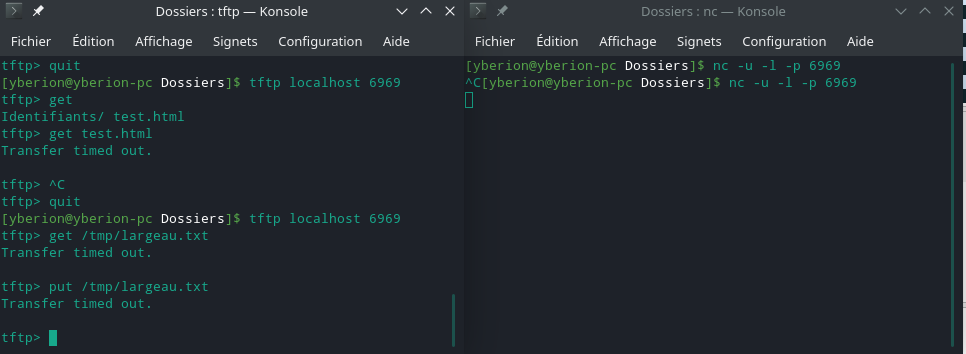

# Compte rendu - IPR - TP2 : UDP

### Emily Delorme - Brandon Largeau

# Partie 1 : protocole TFTP

## Exercice 1 : Observation

Test de création d'un serveur TFTP avec `netcat` (``nc -u -l -p 6969``) et test de connexion avec la commande `tftp` (``tftp localhost 6969``) :



On retrouve bien avec un `timeout`.

### Y a-t-il une demande de connexion initiale ?

Non il n'y a pas de demande de connexion, on ne constate aucun dialogue lors de la connexion.


### Capturez une demande de lecture du fichier `/tmp/$nom.txt` et une demande d'écriture de `/tmp/$nom.txt` ou vous remplacerez `$nom` par votre nom de famille.

On voit sur ce screen les requêtes Read et Write sur le fichier :


### Décrivez les champs de la requête en vous appuyant sur la RFC si nécessaire.

Norme RFC 1350 https://tools.ietf.org/html/rfc1350


```
opcode  operation
1       Read request (RRQ)
2       Write request (WRQ)
3       Data (DATA)
4       Acknowledgment (ACK)
5       Error (ERROR)
```

`Mode : netascii | binary | mail`

**RRQ/WRQ packet**

```
 2 bytes     string    1 byte     string   1 byte
 ------------------------------------------------
| Opcode |  Filename  |   0  |    Mode    |   0  |
 ------------------------------------------------
```

**DATA packet**

Un packet avec la partie data < 512 indique la fin du transfert.

```
 2 bytes     2 bytes      n bytes
 ----------------------------------
| Opcode |   Block #  |   Data     |
 ----------------------------------
```

**ACK packet**

```
 2 bytes     2 bytes
 ---------------------
| Opcode |   Block #  |
 ---------------------
```

**ERROR packet**

```
 2 bytes     2 bytes      string    1 byte
 -----------------------------------------
| Opcode |  ErrorCode |   ErrMsg   |   0  |
 -----------------------------------------
```

## Exercice 2 : Décodage des requêtes.

On part du principe qu'un packet fait 516. Dans le cas d'un packet DATA, on a 2 octets pour ``opcode``, 2 octets pour l'id du block et 512 octets pour ``Data``.

Comme les données sont stockées en byte, pour pouvoir les afficher il a fallu les convertir en String encodage ASCII (TFTP utilise l'encodage ASCII) ou en short quand il s'agit de chiffre.

``ByteBuffer.wrap()`` permet de transformer un tableau de bytes en Buffer de bytes permettant l'accès à des fonctions utilitaires.

``getShort()`` permet de convertir les 2 premiers bytes en ``short``.


```Java
package pr.tp2.udp.tftp;

import org.tinylog.Logger;

import java.io.IOException;
import java.net.DatagramPacket;
import java.net.DatagramSocket;
import java.nio.ByteBuffer;
import java.nio.charset.Charset;
import java.nio.charset.StandardCharsets;
import java.util.Arrays;
import java.util.stream.IntStream;

public class TftpDecode
{
    private static final int PORT = 6969;
    private static final int PACKET_SIZE = 516;

    public static void main(String[] args) throws IOException
    {
        // Attends sur le port 6969
        try (DatagramSocket socket = new DatagramSocket(PORT))
        {
            // Boucle
            while (socket.isBound())
            {
                byte[] buffer = new byte[PACKET_SIZE];
                
                DatagramPacket packet = new DatagramPacket(buffer, buffer.length);
                
                Logger.info("=========================================================");
                Logger.info("Waiting TFTP packet...");
                
                // Blockant
                socket.receive(packet);
                
                // Affichage du packet
                Logger.info("Printing packet:");
                
                printBuffer(Arrays.copyOfRange(buffer, 0, packet.getLength()));
                
                // Décodage du packet
                decodeRequest(packet);
                
                packet.getSocketAddress();
                Logger.info("=========================================================");
            }
        }
    }

    public static void printBuffer(byte[] bytes)
    {
        StringBuilder out = new StringBuilder();
        
        IntStream.range(0, bytes.length).forEach(i ->
        {
            if (i % 16 == 0)
            {
                out.append("\n");
            }
            
            out.append(String.format("%02x ", bytes[i]));
        });
        
        Logger.info(out + "\n");
    }

    public static void decodeRequest(DatagramPacket packet)
    {
        byte[] packetData = Arrays.copyOfRange(packet.getData(), 0, packet.getLength());
        String type = "";
        
        // Used to decode byte arrays
        Charset charset = StandardCharsets.US_ASCII;
        
        // Opcode is the first 2 bytes
        byte[] opcodeBytes = Arrays.copyOfRange(packetData, 0, 2);
        
        ByteBuffer opcodeWrapped = ByteBuffer.wrap(opcodeBytes);
        
        short opcode = opcodeWrapped.getShort();
        
        // Opcode (2 bytes)
        switch (opcode)
        {
            case 1:
            case 2:
            {
            	if (opcode == 1)
            	{
            		type = "1 - Read request (RRQ)";
            	}
            	else
            	{
            		type = "2 - Write request (WRQ)";
            	}
            	
                // The first 2 bytes are for Opcode
                int i = 2;

                // Get the position of the 0 delimiter between filename and mode
                while (packetData[i] != 0)
                {
                    ++i;
                }

                // From 2 to the position of the delimiter (excluded)
                byte[] fileNameBytes = Arrays.copyOfRange(packetData, 2, i);
                
                String fileName = new String(fileNameBytes, charset);
                
                // From i + 1 (so we exclude the delimiter) to the position of the last delimiter (excluded)
                byte[] modeBytes = Arrays.copyOfRange(packetData, i + 1, packetData.length - 1);
                
                String mode = new String(modeBytes, charset);
                
                Logger.info("Type : " + type + ", fichier : " + fileName + ", mode : " + mode);
            	
                return;
            }
            case 3:
            {
                type = "3 - Data (DATA)";
                
                // block Id is 2 bytes, so from 2 to 4 (excluded)
                byte[] blockIdBytes = Arrays.copyOfRange(packetData, 2, 4);
                
                ByteBuffer wrapped = ByteBuffer.wrap(blockIdBytes);
                
                short blockId = wrapped.getShort();
                
                // the data starts at byte 5 (position 4) to the end
                byte[] dataBytes = Arrays.copyOfRange(packetData, 4, packetData.length);
                
                Logger.info("Type : " + type + ", block ID : " + blockId + ", block size : " + dataBytes.length);
                
                Logger.info("Print DATA :");
                
                printBuffer(dataBytes);
                
                return;
            }
            case 4:
            {
                type = "4 - Acknowledgment (ACK)";
                
                // block Id is 2 bytes, so from 2 to 4 (excluded), we want the byte 2 and 3
                byte[] blockIdBytes = Arrays.copyOfRange(packetData, 2, 4);
                
                ByteBuffer wrapped = ByteBuffer.wrap(blockIdBytes);
                
                short blockId = wrapped.getShort();

                Logger.info("Type : " + type + ", block ID : " + blockId);
                
                return;
            }
            case 5:
            {
                type = "5 - Error (ERROR)";
                
                // Opcode is the first 2 bytes
                byte[] errorCodeBytes = Arrays.copyOfRange(packetData, 2, 4);
                
                ByteBuffer errorCodeWrapped = ByteBuffer.wrap(errorCodeBytes);
                
                short errorCode = errorCodeWrapped.getShort();
                
                String errorCodeMessage = "";
                
                switch(errorCode)
                {
	                case 0:
	                	errorCodeMessage = "0 - Not defined, see error message (if any).";
	                	break;
	                case 1:
	                	errorCodeMessage = "1 - File not found.";
	                	break;
	                case 2:
	                	errorCodeMessage = "2 - Access violation.";
	                	break;
	                case 3:
	                	errorCodeMessage = "3 - Disk full or allocation exceeded.";
	                	break;
	                case 4:
	                	errorCodeMessage = "4 - Illegal TFTP operation.";
	                	break;
	                case 5:
	                	errorCodeMessage = "5 - Unknown transfer ID.";
	                	break;
	                case 6:
	                	errorCodeMessage = "6 - File already exists.";
	                	break;
	                case 7:
	                	errorCodeMessage = "7 - No such user.";
	                	break;
	                default:
	                	errorCodeMessage = "Unknown error code";
                }
                
                // From 4 to the end (-1 cause we don't want the 0 delimiter)
                byte[] errorMessageBytes = Arrays.copyOfRange(packetData, 4, packetData.length - 1);
                
                String errorMessage = new String(errorMessageBytes, charset);
                
                Logger.info("Type : " + type + ", code erreur : " + errorCodeMessage + ", code message : " + errorMessage);
                
                return;
            }
            default:
                type = "Unknown Opcode";
                
                Logger.info("Type : " + type);
        }
    }
}
```

## Exercice 3 : Acquitter

Pour les besoins de cet exercice, nous avons modifié ``decodeRequest()`` en ajoutant ``DatagramSocket serverSocket`` en paramètre. On a fait ça comme ça, car on appelle ``sendAck()`` depuis ``decodeRequest()``.

On a donc ajouté ``sendAck()`` pour envoyer un packet ACK :

```Java
public static void sendAck(DatagramSocket serverSocket, short seqNumber, SocketAddress destinationAddr) throws IOException
{
    Logger.info("Sending " + seqNumber + " to " + destinationAddr);

    // Construction of the packet
    ByteBuffer byteBuffer = ByteBuffer.allocate(4);
    byteBuffer.putShort((short) 4);
    byteBuffer.putShort(seqNumber);

    byte[] ackBuffer = byteBuffer.array();

    DatagramPacket ackPacket = new DatagramPacket(ackBuffer, ackBuffer.length, destinationAddr);

    // Display done in decodeRequest()

    // Send the packet to the destination
    serverSocket.send(ackPacket);
}
```

Cette fonction est appelée dans ``decodeRequest()`` lors d'un ``2 - Write request (WRQ)`` pour envoyer un packet ACK avec comme numéro de séquence ``0``.

```Java
if (opcode == 2)
{
    sendAck(serverSocket, (short)0, packet.getSocketAddress());
}
```

Mais aussi lors d'un ``3 - Data (DATA)`` pour confirmer la reçu du packet :

```Java
sendAck(serverSocket, blockId, packet.getSocketAddress());
```

Par example avec un fichier ``tototo.html`` contenant un lorem ipsum de 513 octets :

```
tftp localhost 6969
put tototo.html
```

```
Lorem ipsum dolor sit amet, consectetur adipiscing elit. In magna dui, pellentesque eu lobortis quis, faucibus nec enim. Ut volutpat vulputate vestibulum. Praesent in lacus consectetur, facilisis enim at, ultricies turpis. Aliquam id est commodo, hendrerit tortor vel, euismod lorem. Quisque quis sapien id velit commodo sagittis a sed felis. Donec ac nunc odio. Proin tempus varius lorem vel elementum. Pellentesque accumsan magna urna, eget cursus massa pulvinar a. In suscipit nisl sit amet fermentum volutpat.

```

Voici le résultat que nous avons (effectivement ça ne ressemble pas 100% à ce que vous avez dans l'énoncé du TP) :

```
=========================================================
Waiting TFTP packet...
Printing packet:

00 02 74 6f 74 6f 74 6f 2e 68 74 6d 6c 00 6e 65 
74 61 73 63 69 69 00 

Type : 2 - Write request (WRQ), fichier : tototo.html, mode : netascii
Sending 0 to /0:0:0:0:0:0:0:1:37559
=========================================================
=========================================================
Waiting TFTP packet...
Printing packet:

00 03 00 01 4c 6f 72 65 6d 20 69 70 73 75 6d 20 
64 6f 6c 6f 72 20 73 69 74 20 61 6d 65 74 2c 20 
63 6f 6e 73 65 63 74 65 74 75 72 20 61 64 69 70 
69 73 63 69 6e 67 20 65 6c 69 74 2e 20 49 6e 20 
6d 61 67 6e 61 20 64 75 69 2c 20 70 65 6c 6c 65 
6e 74 65 73 71 75 65 20 65 75 20 6c 6f 62 6f 72 
74 69 73 20 71 75 69 73 2c 20 66 61 75 63 69 62 
75 73 20 6e 65 63 20 65 6e 69 6d 2e 20 55 74 20 
76 6f 6c 75 74 70 61 74 20 76 75 6c 70 75 74 61 
74 65 20 76 65 73 74 69 62 75 6c 75 6d 2e 20 50 
72 61 65 73 65 6e 74 20 69 6e 20 6c 61 63 75 73 
20 63 6f 6e 73 65 63 74 65 74 75 72 2c 20 66 61 
63 69 6c 69 73 69 73 20 65 6e 69 6d 20 61 74 2c 
20 75 6c 74 72 69 63 69 65 73 20 74 75 72 70 69 
73 2e 20 41 6c 69 71 75 61 6d 20 69 64 20 65 73 
74 20 63 6f 6d 6d 6f 64 6f 2c 20 68 65 6e 64 72 
65 72 69 74 20 74 6f 72 74 6f 72 20 76 65 6c 2c 
20 65 75 69 73 6d 6f 64 20 6c 6f 72 65 6d 2e 20 
51 75 69 73 71 75 65 20 71 75 69 73 20 73 61 70 
69 65 6e 20 69 64 20 76 65 6c 69 74 20 63 6f 6d 
6d 6f 64 6f 20 73 61 67 69 74 74 69 73 20 61 20 
73 65 64 20 66 65 6c 69 73 2e 20 44 6f 6e 65 63 
20 61 63 20 6e 75 6e 63 20 6f 64 69 6f 2e 20 50 
72 6f 69 6e 20 74 65 6d 70 75 73 20 76 61 72 69 
75 73 20 6c 6f 72 65 6d 20 76 65 6c 20 65 6c 65 
6d 65 6e 74 75 6d 2e 20 50 65 6c 6c 65 6e 74 65 
73 71 75 65 20 61 63 63 75 6d 73 61 6e 20 6d 61 
67 6e 61 20 75 72 6e 61 2c 20 65 67 65 74 20 63 
75 72 73 75 73 20 6d 61 73 73 61 20 70 75 6c 76 
69 6e 61 72 20 61 2e 20 49 6e 20 73 75 73 63 69 
70 69 74 20 6e 69 73 6c 20 73 69 74 20 61 6d 65 
74 20 66 65 72 6d 65 6e 74 75 6d 20 76 6f 6c 75 
74 70 61 74 

Type : 3 - Data (DATA), block ID : 1, block size : 512
Printing DATA:

4c 6f 72 65 6d 20 69 70 73 75 6d 20 64 6f 6c 6f 
72 20 73 69 74 20 61 6d 65 74 2c 20 63 6f 6e 73 
65 63 74 65 74 75 72 20 61 64 69 70 69 73 63 69 
6e 67 20 65 6c 69 74 2e 20 49 6e 20 6d 61 67 6e 
61 20 64 75 69 2c 20 70 65 6c 6c 65 6e 74 65 73 
71 75 65 20 65 75 20 6c 6f 62 6f 72 74 69 73 20 
71 75 69 73 2c 20 66 61 75 63 69 62 75 73 20 6e 
65 63 20 65 6e 69 6d 2e 20 55 74 20 76 6f 6c 75 
74 70 61 74 20 76 75 6c 70 75 74 61 74 65 20 76 
65 73 74 69 62 75 6c 75 6d 2e 20 50 72 61 65 73 
65 6e 74 20 69 6e 20 6c 61 63 75 73 20 63 6f 6e 
73 65 63 74 65 74 75 72 2c 20 66 61 63 69 6c 69 
73 69 73 20 65 6e 69 6d 20 61 74 2c 20 75 6c 74 
72 69 63 69 65 73 20 74 75 72 70 69 73 2e 20 41 
6c 69 71 75 61 6d 20 69 64 20 65 73 74 20 63 6f 
6d 6d 6f 64 6f 2c 20 68 65 6e 64 72 65 72 69 74 
20 74 6f 72 74 6f 72 20 76 65 6c 2c 20 65 75 69 
73 6d 6f 64 20 6c 6f 72 65 6d 2e 20 51 75 69 73 
71 75 65 20 71 75 69 73 20 73 61 70 69 65 6e 20 
69 64 20 76 65 6c 69 74 20 63 6f 6d 6d 6f 64 6f 
20 73 61 67 69 74 74 69 73 20 61 20 73 65 64 20 
66 65 6c 69 73 2e 20 44 6f 6e 65 63 20 61 63 20 
6e 75 6e 63 20 6f 64 69 6f 2e 20 50 72 6f 69 6e 
20 74 65 6d 70 75 73 20 76 61 72 69 75 73 20 6c 
6f 72 65 6d 20 76 65 6c 20 65 6c 65 6d 65 6e 74 
75 6d 2e 20 50 65 6c 6c 65 6e 74 65 73 71 75 65 
20 61 63 63 75 6d 73 61 6e 20 6d 61 67 6e 61 20 
75 72 6e 61 2c 20 65 67 65 74 20 63 75 72 73 75 
73 20 6d 61 73 73 61 20 70 75 6c 76 69 6e 61 72 
20 61 2e 20 49 6e 20 73 75 73 63 69 70 69 74 20 
6e 69 73 6c 20 73 69 74 20 61 6d 65 74 20 66 65 
72 6d 65 6e 74 75 6d 20 76 6f 6c 75 74 70 61 74 

Sending 1 to /0:0:0:0:0:0:0:1:37559
=========================================================
=========================================================
Waiting TFTP packet...
Printing packet:

00 03 00 02 2e 0d 0a 

Type : 3 - Data (DATA), block ID : 2, block size : 3
Printing DATA:

2e 0d 0a 

Sending 2 to /0:0:0:0:0:0:0:1:37559
=========================================================
=========================================================
Waiting TFTP packet...
```

On voit bien qu'on a 2 packets DATA, le premier avec 512 octets de donnée et le second avec 3 octets de donnée. Le dernier contient le ``. -> 2E`` et le retour à la ligne ``CRLF -> 0D0A``.

## Exercice 4

On regarde ce qu'il se passe avec Wireshard, on utilise le filtre ``udp`` :


On voit qu'on à bien les bons packets :

* Le client envoie le PUT avec nom de fichier et mode ``34355 → 6969 Len=23``
* Le serveur envoie un packet ACK 0 pour indiquer qu'il à bien reçu la demande d'écriture ``6969 → 34355 Len=4``
* Le client envoie le premier packet DATA avec les données + numéro de séquence 1 ``34355 → 6969 Len=516``
* Le serveur envoie un packet ACK avec numéro de séquence 1 ``6969 → 34355 Len=4``
* Le client envoie le dernier packet DATA avec les données + numéro de séquence 2 ``34355 → 6969 Len=7``
* Le serveur envoie un packet ACK avec numéro de séquence 2 ``6969 → 34355 Len=4``
* Le fichier est entièrement transféré par le client et le serveur à bien tout reçu

# Partie 2 : Protocole de découverte multicast

Le but de cette partie est d'avoir un système de message qui fonctionne avec des abonnés via une adresse et un port.

Il suffit qu'un abonné soit en écoute sur cette adresse pour qu'il puisse recevoir des messages.

Si un message est envoyé à cette adresse, tous les abonnés en attente recevront ce message.

La fonction ``listenAndReply()`` écoute tous les messages sur l'adresse ``225.0.4.1`` avec le port ``9999``. Ils sont ensuite affichés et lorsque c'est un message ``WHOIS`` qui est reçu, avec l'identifiant ``051005022``, alors un message ``IAM`` est envoyé en retour avec en identifiant ``051005022`` et URL ``https://istic.univ-rennes1.fr/``. Elle reçoit son propre message vu qu'elle est en écoute de n'importe qu'elle message sur l'adresse.

Les fonctions ``sendXXX()`` permettent d'envoyer un message (avec ID, URL en plus pour IAM) sur l'adresse ``225.0.4.1`` avec le port ``9999``.

En testant avec ``pr.tp2.udp.discovery.TestDiscovery`` :

```Java
package pr.tp2.udp.discovery;

import java.io.IOException;

import org.tinylog.Logger;

public class TestDiscovery
{
    public static void main(String[] args) throws InterruptedException, IOException
    {
        Runnable listener = () ->
        {
			try
			{
				Discovery.listenAndReply();
			}
			catch (IOException e)
			{
				Logger.trace(e);
			}
		};
        
        new Thread(listener).start();
        
        // Wait a bit before sending anything, so everything is properly initialized
        Thread.sleep(1000);
        
        Discovery.sendWhois("051005022");
        Discovery.sendIAM("tftp", "127.0.0.1:6969");
        
        Thread.sleep(10000);
    }
}
```

On obtient le résultat suivant :

```
From sendWhois - Sending message : WHOIS:051005022
From listenAndReply - Receiving message : WHOIS:051005022
From sendIAM - Sending message : IAM:tftp:127.0.0.1:6969
From sendIAM - Sending message : IAM:051005022:https://istic.univ-rennes1.fr/
From listenAndReply - Receiving message : IAM:tftp:127.0.0.1:6969
From listenAndReply - Receiving message : IAM:051005022:https://istic.univ-rennes1.fr/
```

Rien n'est séquentiel, car ``listenAndReply()`` est lancé sur un thread séparé de l'appel des fonctions ``sendWhois()`` et ``sendIAM()``.

```Java
package pr.tp2.udp.discovery;

import java.io.IOException;
import java.net.DatagramPacket;
import java.net.InetAddress;
import java.net.MulticastSocket;
import java.nio.charset.StandardCharsets;

import org.tinylog.Logger;

public class Discovery
{
	private static final String IP = "225.0.4.1";
	private static final int PORT = 9999;
	
    public static void sendWhois(String id) throws IOException
    {
        // Envoie un message Whois
    	
    	InetAddress groupeIP = InetAddress.getByName(IP);

        byte[] contenuMessage = (("WHOIS:" + id).toString().getBytes());
        
        DatagramPacket message;
        
        message = new DatagramPacket(contenuMessage, contenuMessage.length, groupeIP, PORT);
        
        try (MulticastSocket socketEmission = new MulticastSocket(PORT))
        {
        	Logger.info("From sendWhois - Sending message : " + new String(contenuMessage));
        	
        	socketEmission.send(message);
        }
    }

    public static void sendLeaving(String id) throws IOException
    {
        // Envoie un message Leaving
    	
    	InetAddress groupeIP = InetAddress.getByName(IP);

        byte[] contenuMessage = (("LEAVING:" + id).toString().getBytes());
        
        DatagramPacket message;
        
        message = new DatagramPacket(contenuMessage, contenuMessage.length, groupeIP, PORT);
        
        try (MulticastSocket socketEmission = new MulticastSocket(PORT))
        {
        	Logger.info("From sendLeaving - Sending message : " + new String(contenuMessage));
        	
        	socketEmission.send(message);
        }
    }

    public static void sendIAM(String id, String url) throws IOException
    {
        // Envoie un message IAM
    	
    	InetAddress groupeIP = InetAddress.getByName(IP);

        byte[] contenuMessage = (("IAM:" + id + ":" + url).toString().getBytes());
        
        DatagramPacket message;
        
        message = new DatagramPacket(contenuMessage, contenuMessage.length, groupeIP, PORT);
        
        try (MulticastSocket socketEmission = new MulticastSocket(PORT))
        {
        	Logger.info("From sendIAM - Sending message : " + new String(contenuMessage));
        	
        	socketEmission.send(message);
        }
    }

    public static void listenAndReply() throws IOException
    {
        // Ecoute et affiche les évennements IAM, LEAVING, WHOIS
    	
    	final String ID = "051005022";
        final String URL = "https://istic.univ-rennes1.fr/";
    	
    	InetAddress groupeIP = InetAddress.getByName(IP);
        
    	DatagramPacket message;
        byte[] contenuMessage;

        String messageReceive;
        
    	try(MulticastSocket socketReception = new MulticastSocket(PORT))
    	{
    		socketReception.joinGroup(groupeIP);
    		
    		while (socketReception.isBound())
    		{
	    		contenuMessage = new byte[1024];
	    		
	    		message = new DatagramPacket(contenuMessage, contenuMessage.length);

	    		socketReception.receive(message);
	    		
	    		messageReceive = new String(contenuMessage, 0, message.getLength(), StandardCharsets.US_ASCII);
	    		
	    		Logger.info("From listenAndReply - Receiving message : " + messageReceive);
	    		
	    		String[] splittedMessage = messageReceive.split(":");
	    		
	    		// Make sure we have a message and an id
	    		// Réponds aux WHOIS si ID = ID
	    		if (splittedMessage.length >= 2)
	    		{
	    			if (splittedMessage[0].equals("WHOIS") && splittedMessage[1].equals(ID))
	    			{
	    				sendIAM(ID, URL);
	    			}
	    		}
    		}
    	}
    }

    public static void main(String[] args) throws IOException
    {

...
```